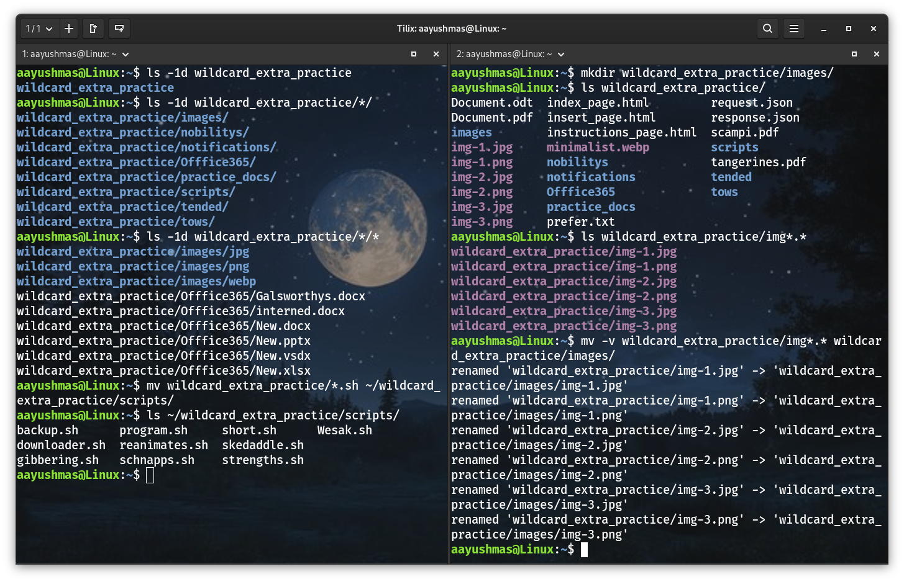
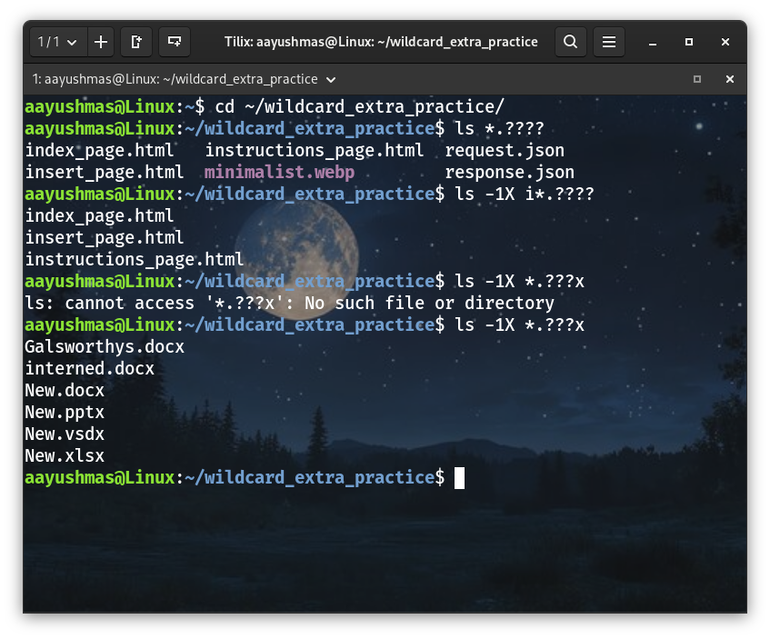
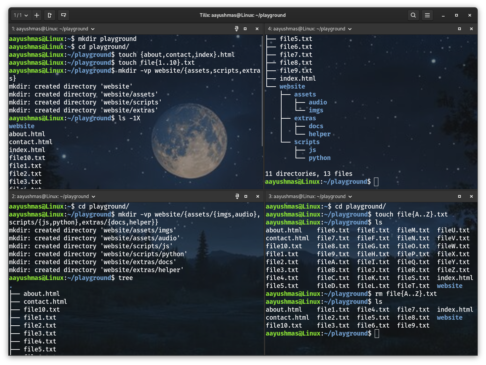
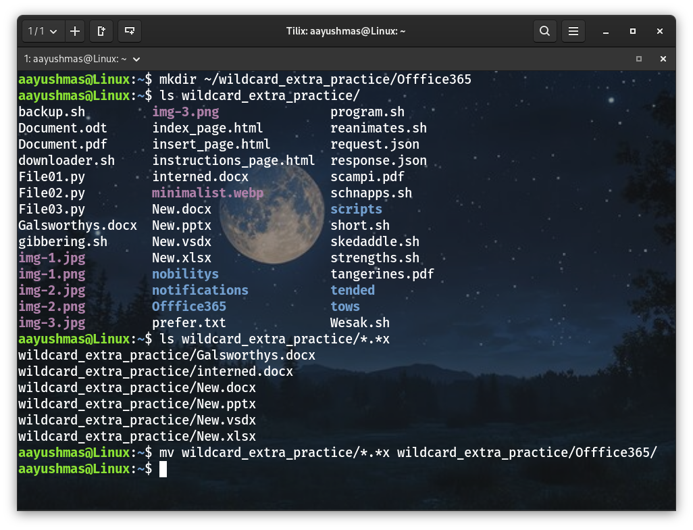
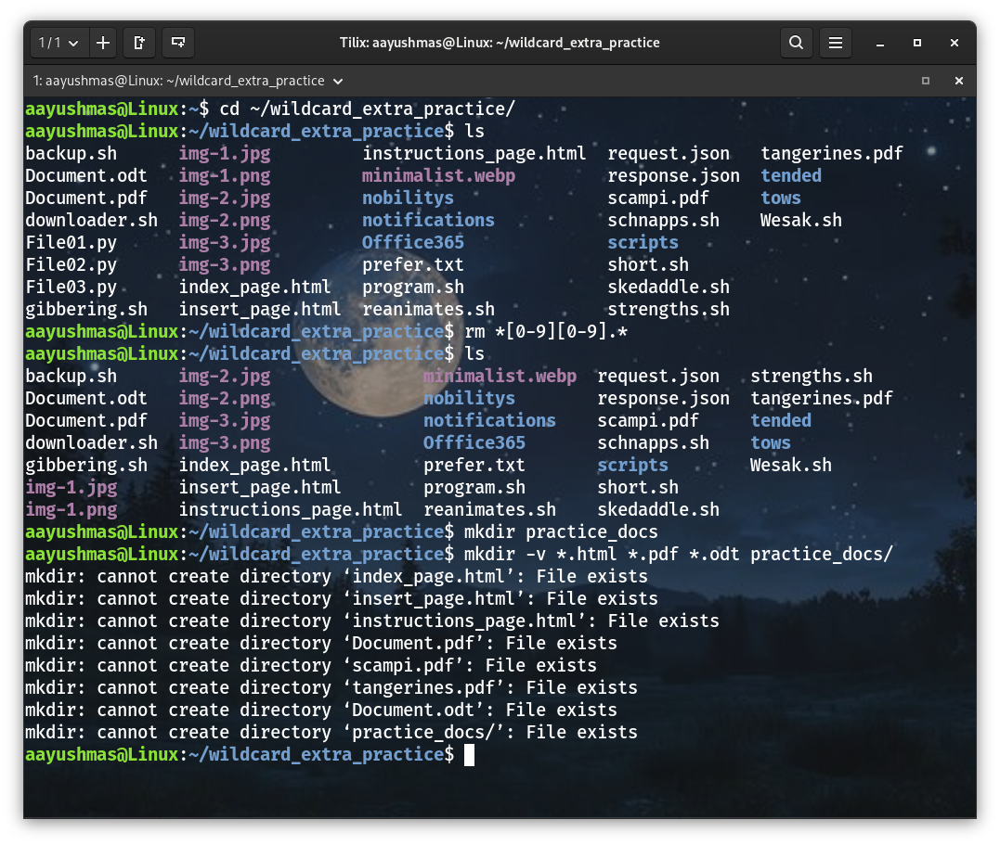
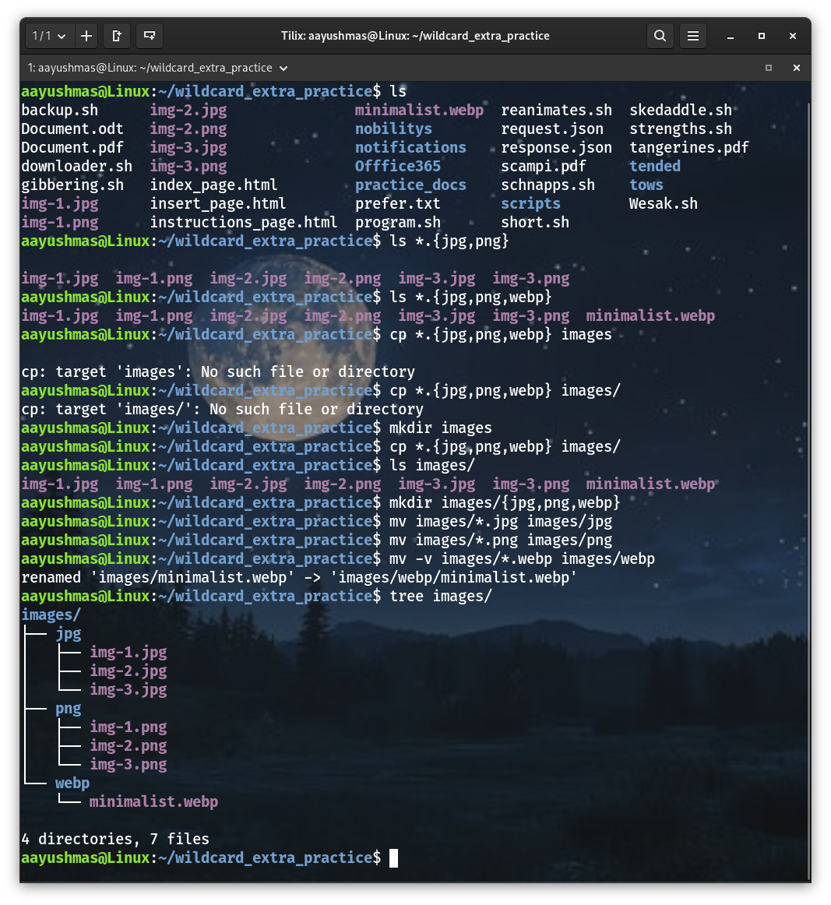

# Extra Credit 6: Wildcards

## The * (star/asterisk) wildcard:

## The ? (question mark) wildcard:

## The [] (square brackets) wildcard:

## Brace Expansion {}:

## Challenge Practice 1:

## Challenge Practice 2:

## Challenge Practice 3:
