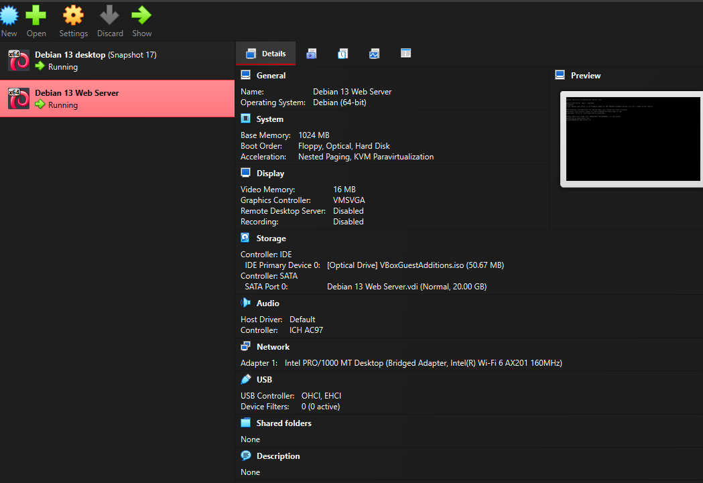
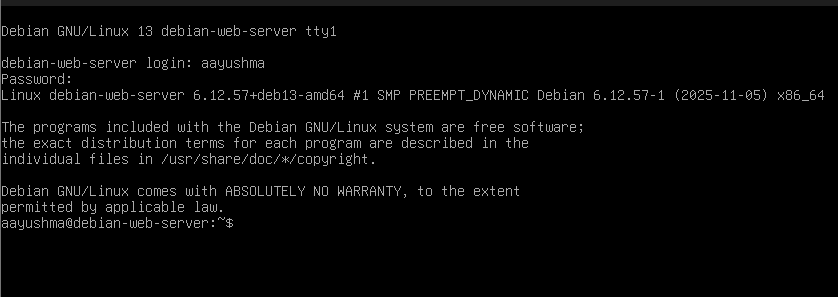
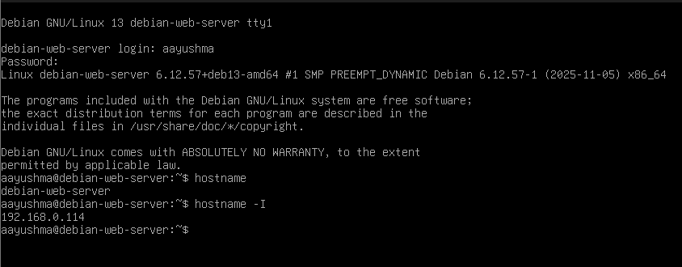
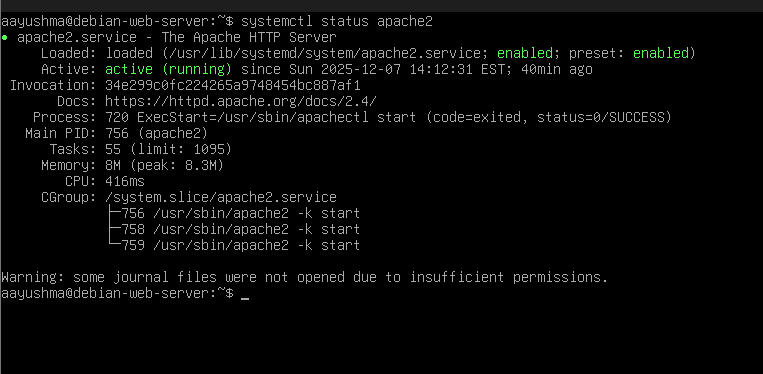
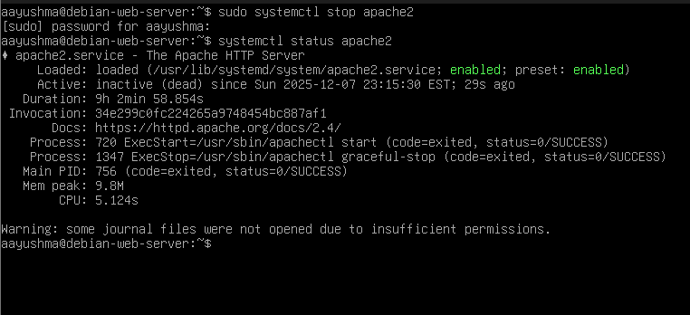
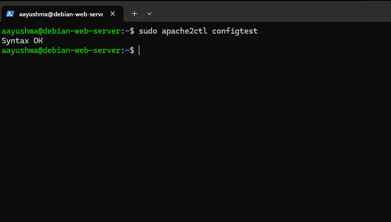
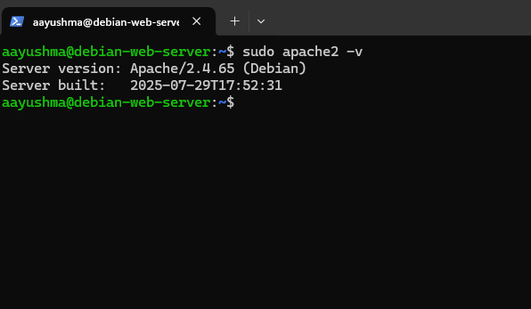
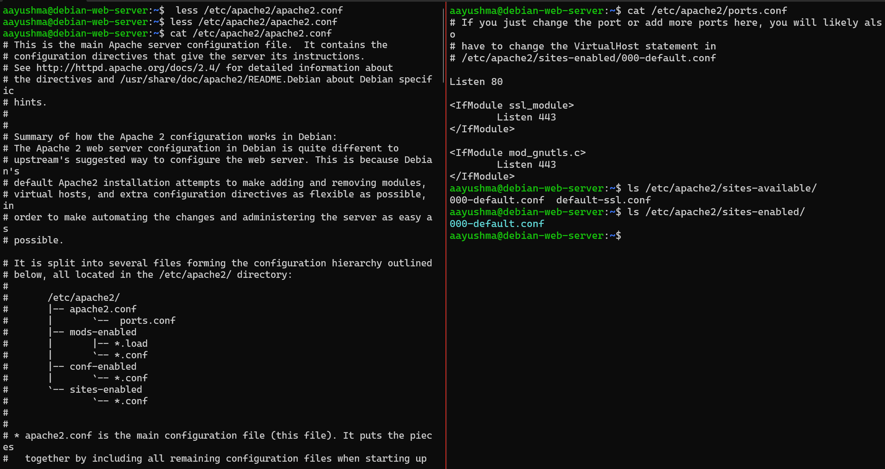
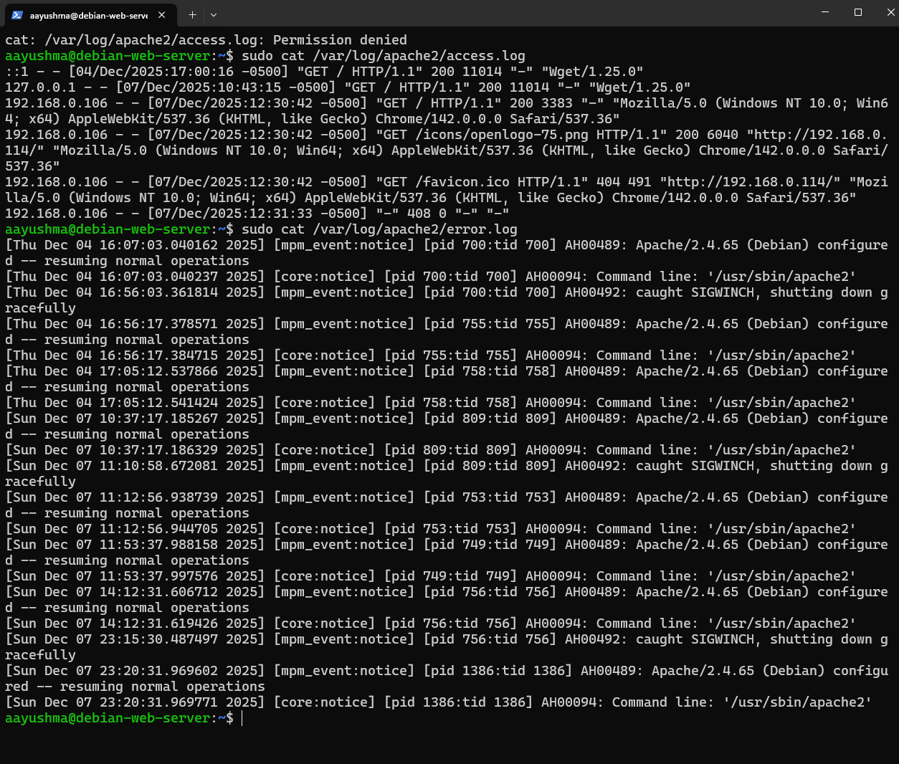

# Deliverable 2

1. What are the server hardware specifications (virtual machine settings)?

2. What is the Debian Login Screen?

3. What is the IP address of your Debian Server Virtual Machine?

4. How do you work with the Firewall in Debian? (Type and explain what each command does)
   1. How do you check if the Firewall is running?
   * Command: `systemctl status ufw`
   This command checks the current status of the UFW firewall service on our system.

   2. How do you disable the Firewall?
   * Command: `sudo ufw disable`
   This command turns off the UFW firewall completely.

   3. How do you add Apache to the Firewall?
    * Command: `sudo ufw allow 'WWW Full'`
    This command opens both HTTP and HTTPS ports on our firewall to set up Apache server.

5. What different commands do we use to work with Apache? (Type and explain what each command does and include a screenshot!)
   1. What is the command you use to check if Apache is running?
   * Command: `systemctl status apache2`
    
    

   2. What is the command you use to stop Apache?
   * Command: `sudo systemctl stop apache2`

    

   3. What is the command you use to restart Apache?
   * Command: `sudo systemctl restart apache2`

    

   4. What is the command used to test Apache configuration?
   * Command: `sudo apache2ctl configtest`

    

   5. What is the command used to check the installed version of Apache?
   * Command: `sudo apache2 -v`

    

   6. What are some common configuration files for Apache?
    * Command: 
      * `/etc/apache2/apache2.conf` → main configuration file
      * `/etc/apache2/ports.conf` → port definitions
      * `/etc/apache2/sites-available/` → virtual host configuration directory
      * `/etc/apache2/sites-enabled/` → symlinks to active sites

    

   7. Where does Apache store logs?
    * Command:
      * `/var/log/apache2/access.log` → all access requests
      * `/var/log/apache2/error.log` → errors and issues

    

   8. What are some basic commands we can use to review logs?
1. View last lines of Apache error log
sudo tail /var/log/apache2/error.log

1. Follow Apache logs live
sudo tail -f /var/log/apache2/error.log

Shows new log entries as they happen.

3. Check access log
sudo tail /var/log/apache2/access.log

4. Use less to scroll logs
less /var/log/apache2/error.log

5. Search inside logs with grep
grep "error" /var/log/apache2/error.log

Case-insensitive:

grep -i "failed" /var/log/apache2/error.log

6. View system logs related to Apache (systemd)
journalctl -u apache2

Follow in real-time:

journalctl -u apache2 -f

1. View logs with cat

Shows the whole file at once (not good for large logs but simple).

cat /var/log/syslog

2. View logs with less (best for reading)

Lets you scroll up/down.

less /var/log/syslog

Controls:

↑ / ↓ to scroll

/text to search

q to quit

3. View the last lines: tail

Shows the end of a log (latest entries).

tail /var/log/syslog

See more lines:

tail -n 100 /var/log/syslog

Follow log in real-time:

tail -f /var/log/syslog

Great for monitoring services.

4. View the beginning: head
head /var/log/syslog

5. Search inside logs: grep

Find lines that contain a word:

grep "error" /var/log/syslog

Case-insensitive:

grep -i "error" /var/log/syslog

Search recursively in folders:

grep -r "error" /var/log/