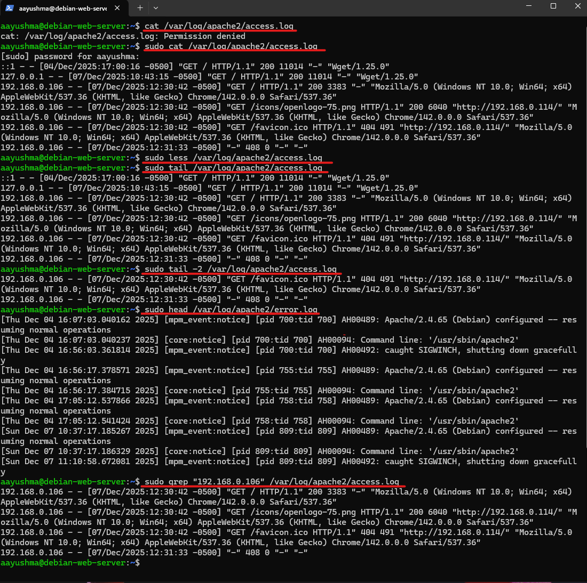

# Deliverable 2

## 1. What are the server hardware specifications (virtual machine settings)?

## 2. What is the Debian Login Screen?

## 3. What is the IP address of your Debian Server Virtual Machine?

## 4. How do you work with the Firewall in Debian?
  **1. How do you check if the Firewall is running?**
  * Command: `systemctl status ufw`
  * This command checks the current status of the UFW firewall service on our system.

  **2. How do you disable the Firewall?**
  * Command: `sudo ufw disable`
  * This command turns off the UFW firewall completely.

  **3. How do you add Apache to the Firewall?**
  * Command: `sudo ufw allow 'WWW Full'`
  * This command opens both HTTP and HTTPS ports on our firewall to set up Apache server.

## 5. What different commands do we use to work with Apache?
  **1. What is the command you use to check if Apache is running?**
  * Command: `systemctl status apache2`

  

  **2. What is the command you use to stop Apache?**
  * Command: `sudo systemctl stop apache2`

  

  **3. What is the command you use to restart Apache?**
  * Command: `sudo systemctl restart apache2`

  

  **4. What is the command used to test Apache configuration?**
  * Command: `sudo apache2ctl configtest`

  

  **5. What is the command used to check the installed version of Apache?**
  * Command: `sudo apache2 -v`

  

  **6. What are some common configuration files for Apache?**
  * Command: 
      * `/etc/apache2/apache2.conf` → main configuration file
      * `/etc/apache2/ports.conf` → port definitions
      * `/etc/apache2/sites-available/` → virtual host configuration directory
      * `/etc/apache2/sites-enabled/` → symlinks to active sites

    

  **7. Where does Apache store logs?**
  * Command:
    * `/var/log/apache2/access.log` → all access requests
    * `/var/log/apache2/error.log` → errors and issues

    

  **8. What are some basic commands we can use to review logs?**
  * View logs with cat
    * `sudo cat /var/log/apache2/access.log`

  * View logs with less.(Lets you scroll up/down,q to quit)
    * `sudo less /var/log/apache2/access.log`

  * View the last lines: tail
    * `sudo tail -2 /var/log/apache2/access.log`

  * View the beginning: head
    * `sudo head /var/log/apache2/error.log`

  * Search inside logs with grep (find lines that contain a word)
    * `grep "192.168.0.106" /var/log/apache2/access.log`

