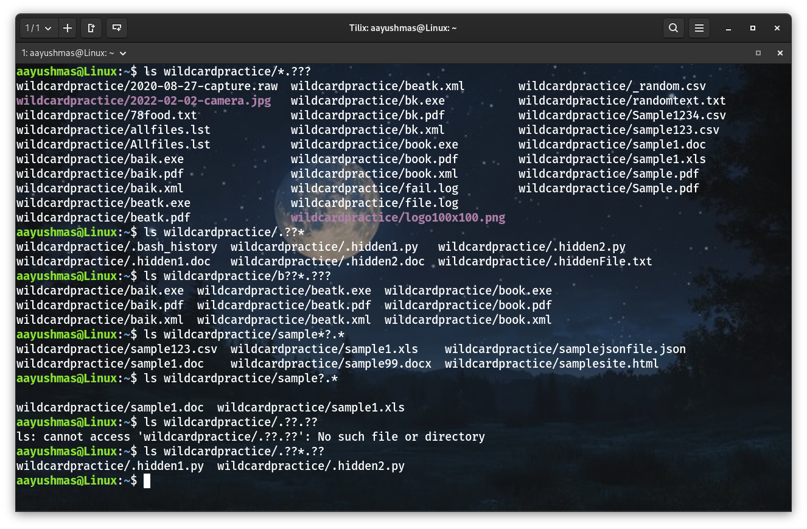
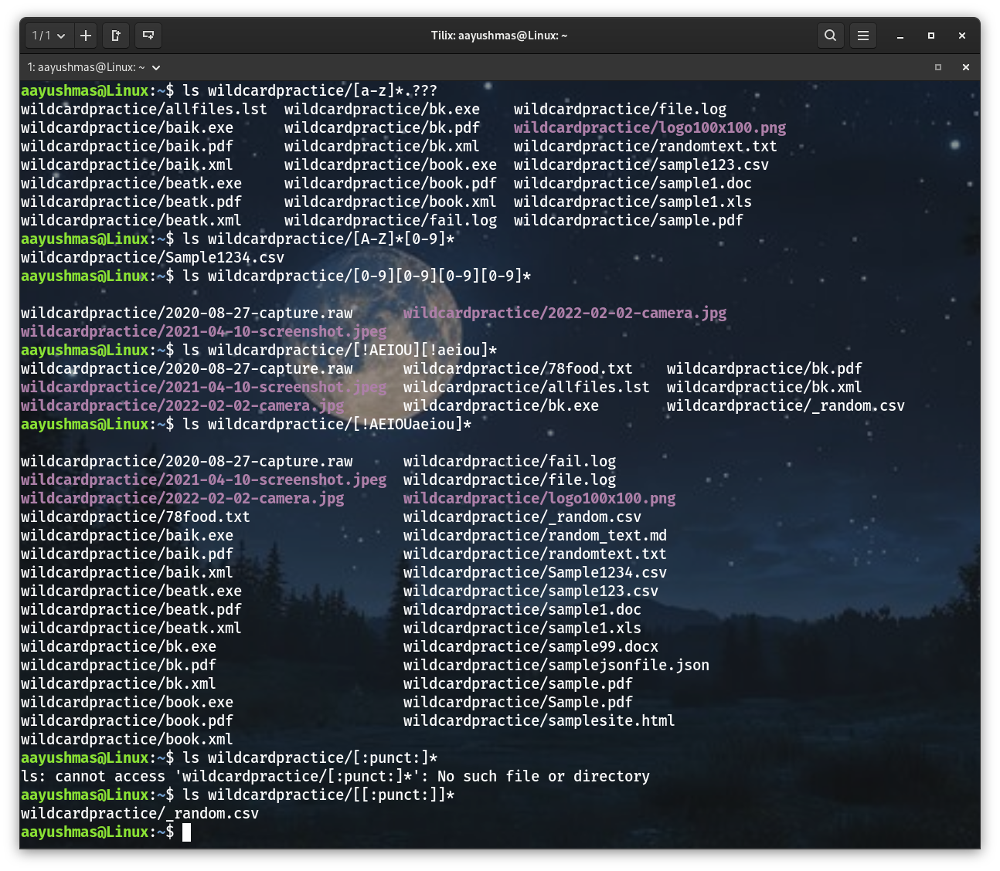
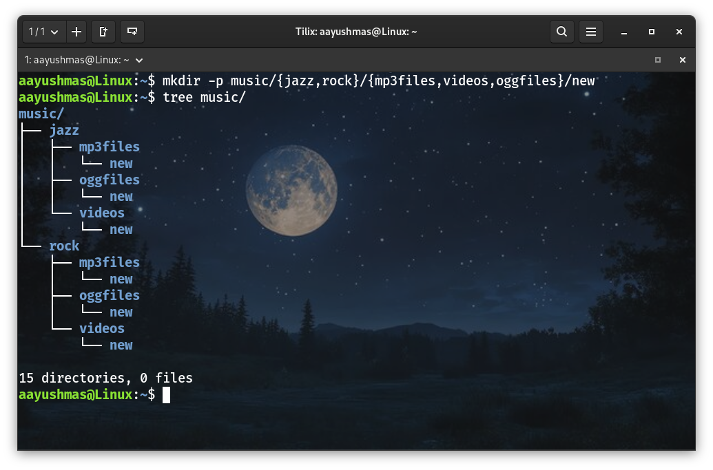
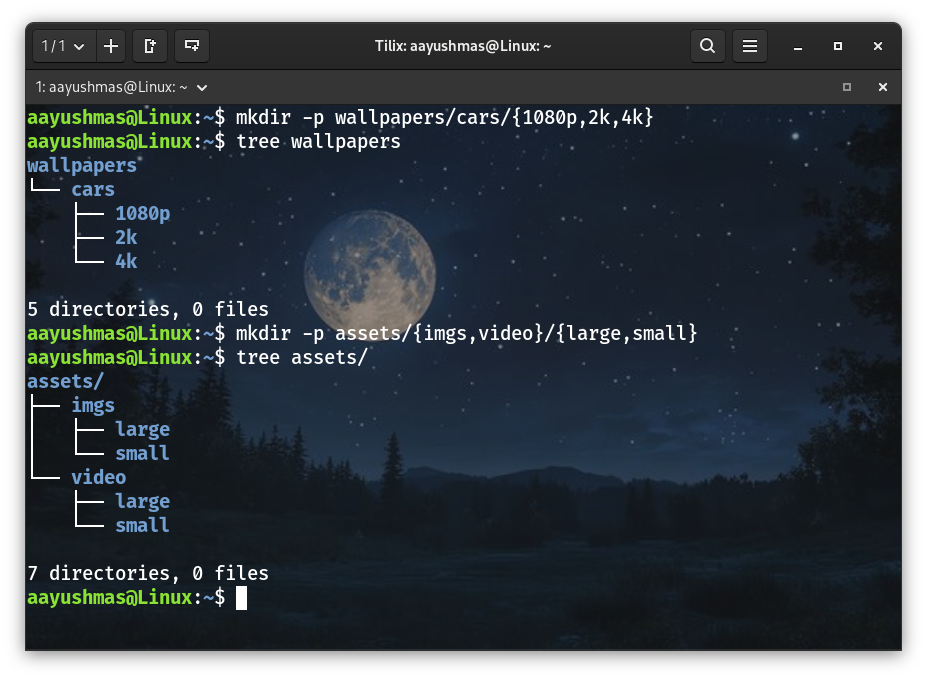
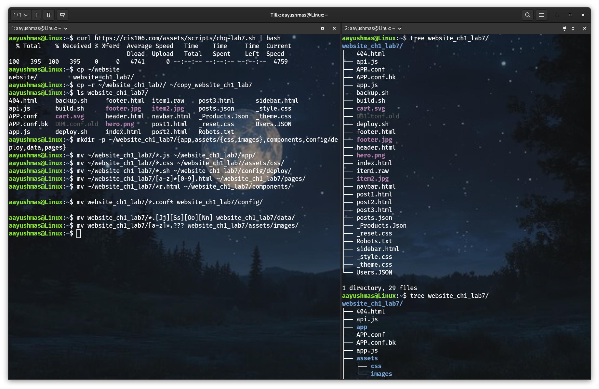

# Lab 7 Submission
**Note for professor:** - Due to some unexpected issue with my VirtualBox, there was a delay while submitting this assignment. Please consider it.

## Question 1: Complete Practice Exercise
### Practice 1: The * wildcard

### Practice 2: The ? wildcard

### Practice 3: The [] wildcard

### Practice 4: Brace Expansion

## Question 2: Challenge 1

## Question 3: Challenge 2

