# Lab 9

## Question 1: Working with saving commands output to a file
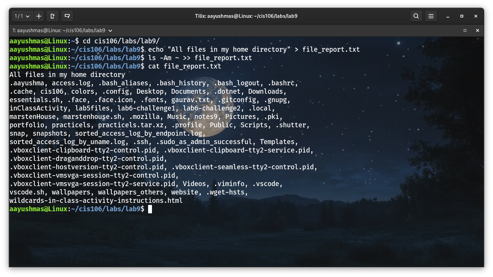

## Question 2: Working with the | (pipe)
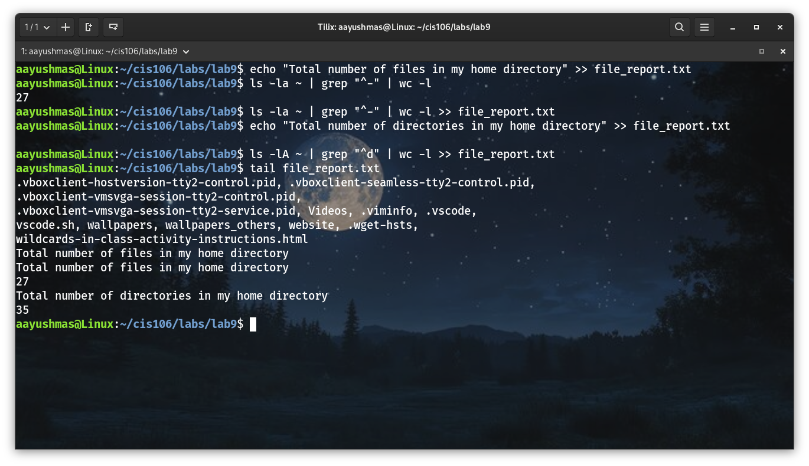

## Question 3: Awk and Sed
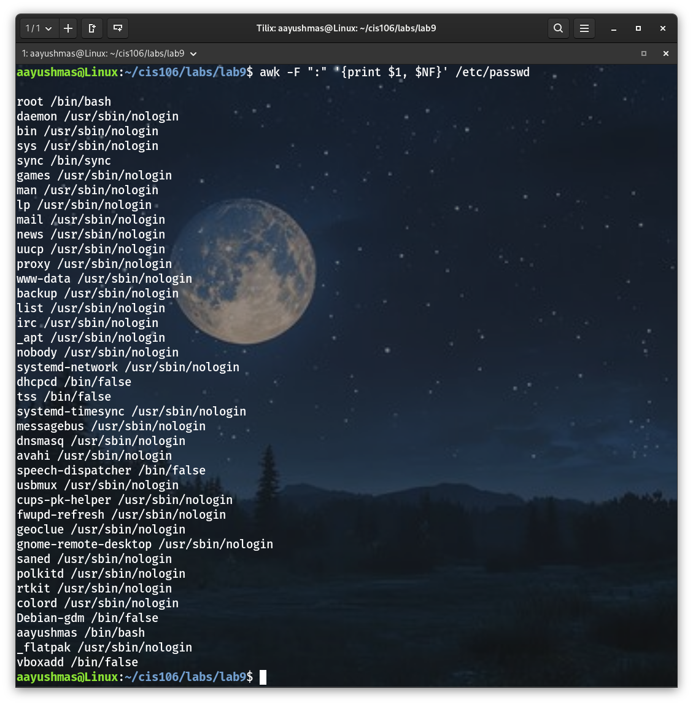

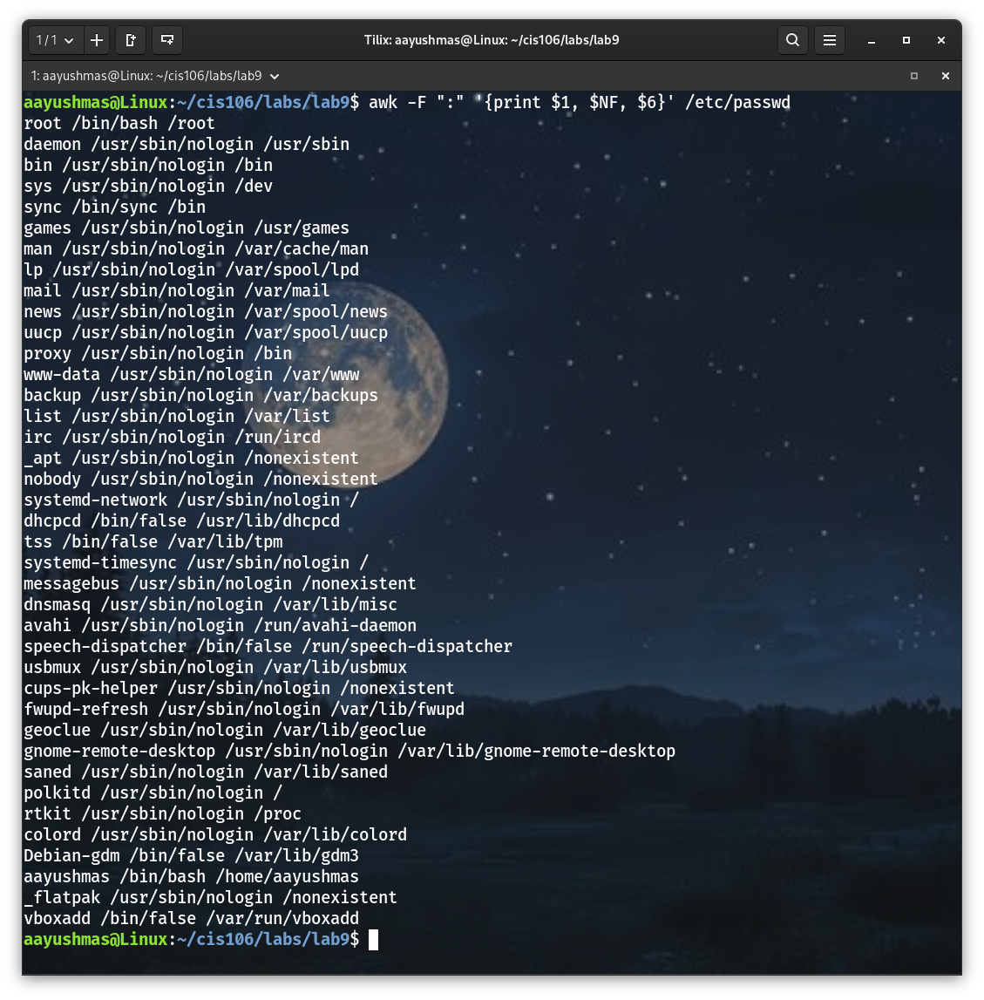

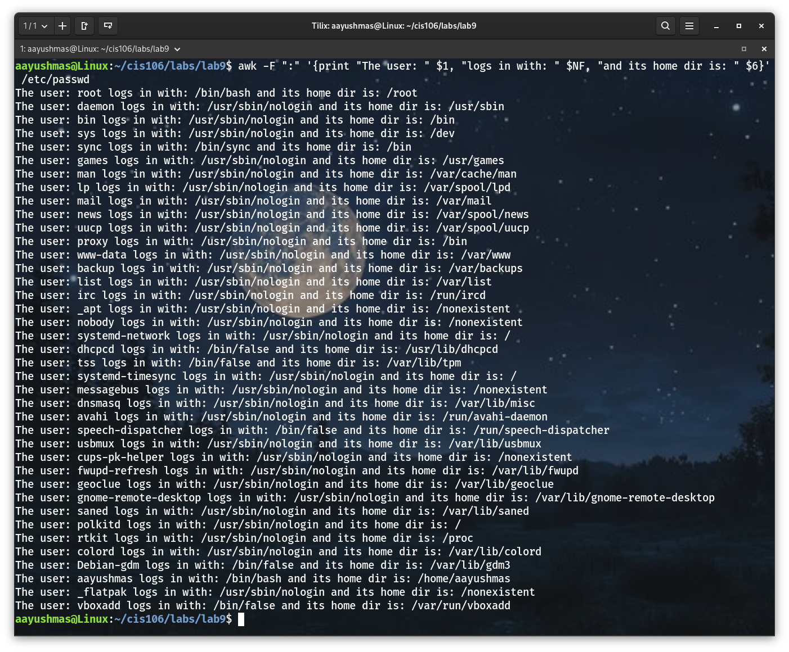

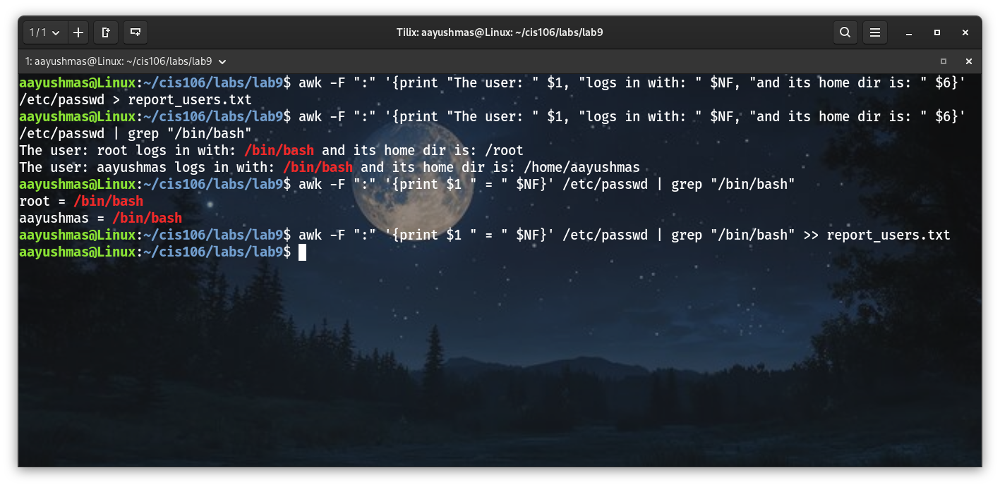

## Question 4:
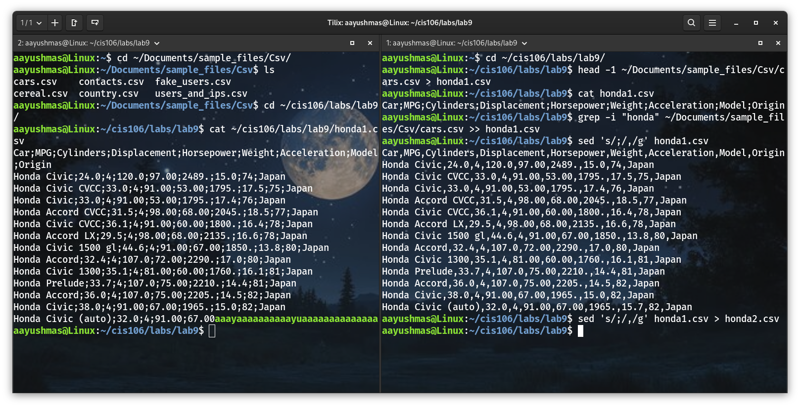

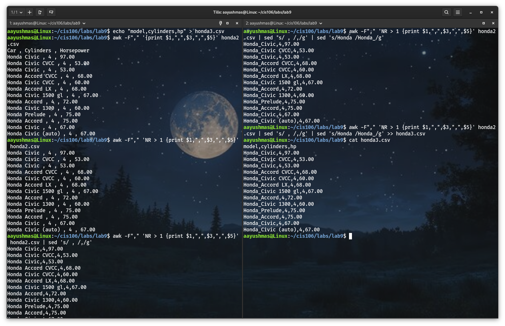

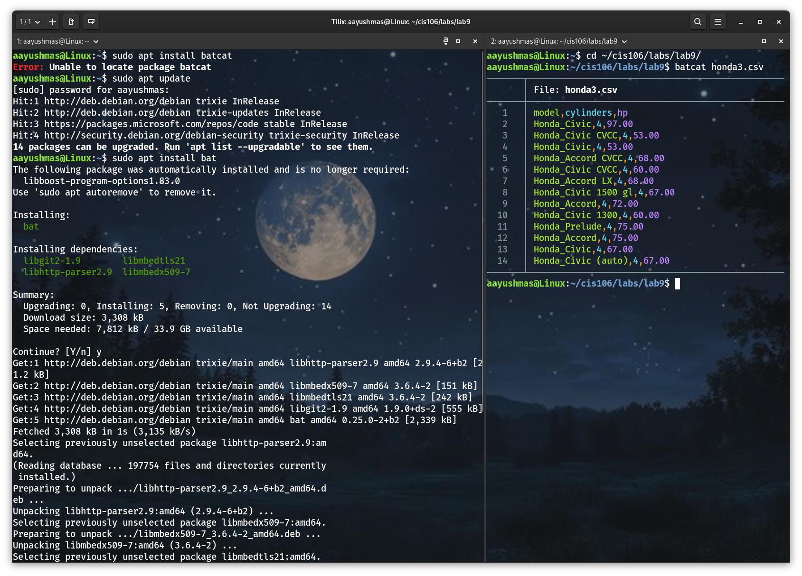

## Challenge Question:
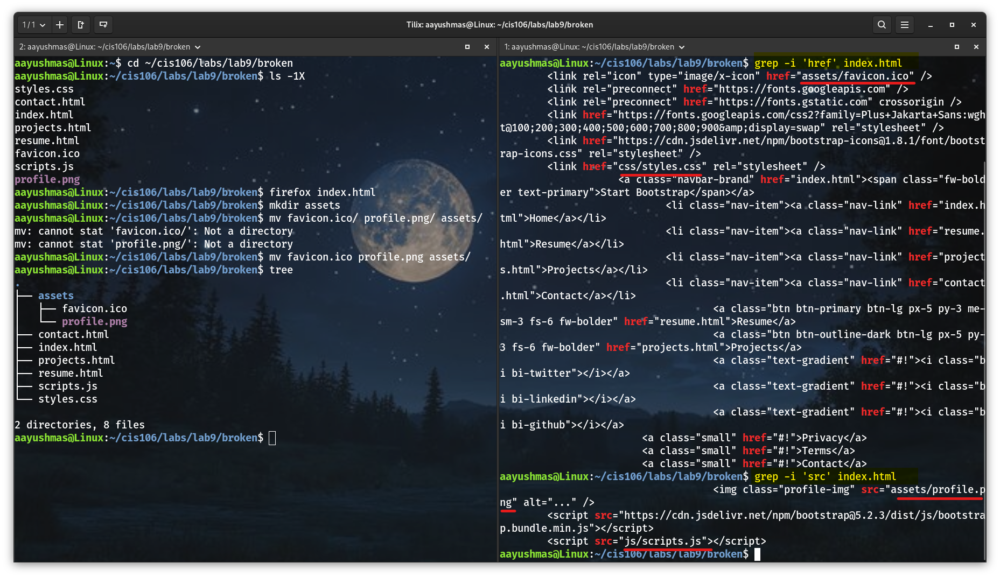

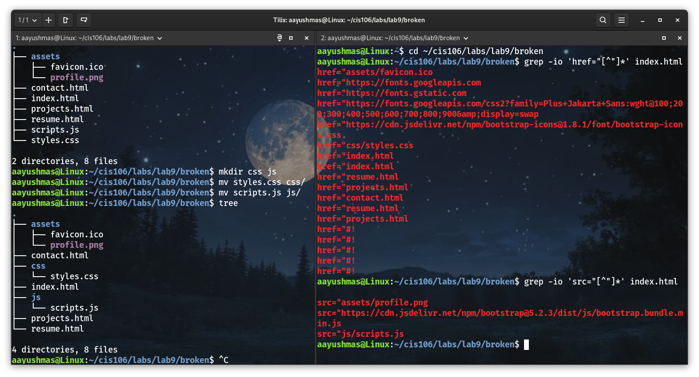

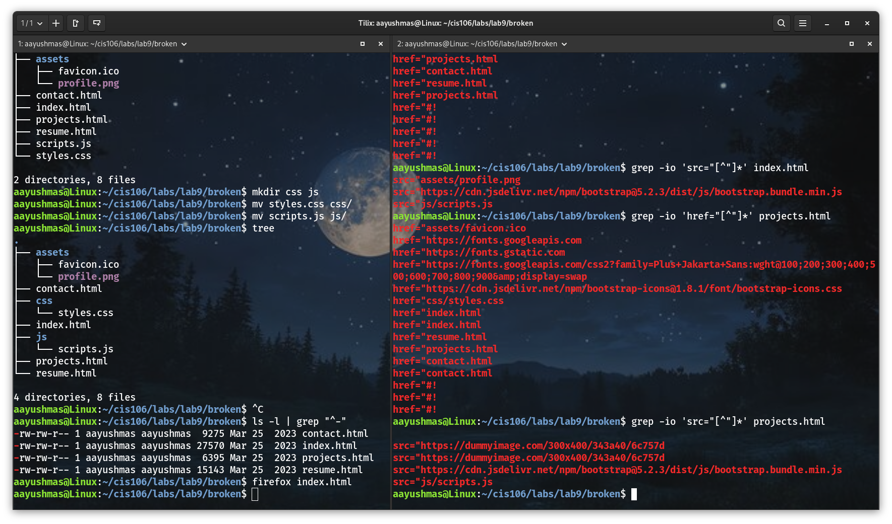

