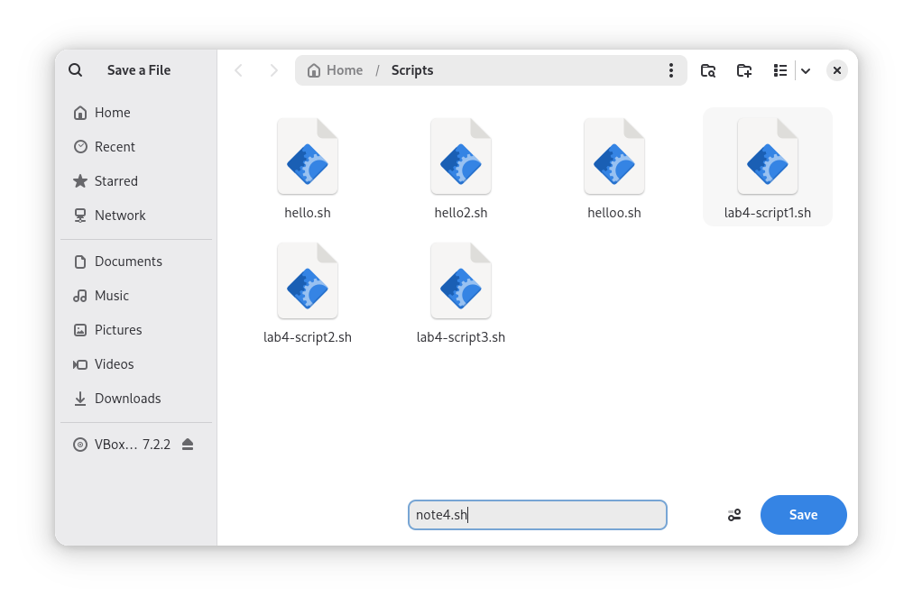
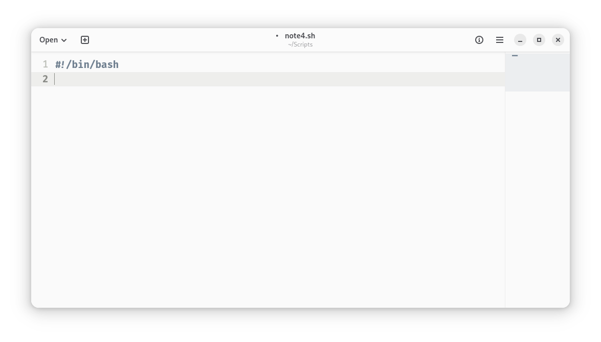
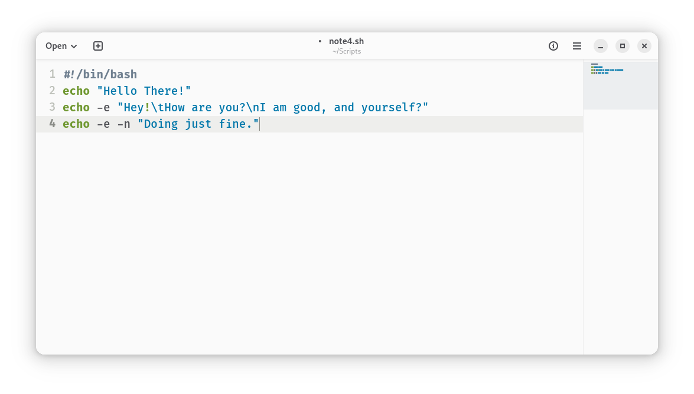
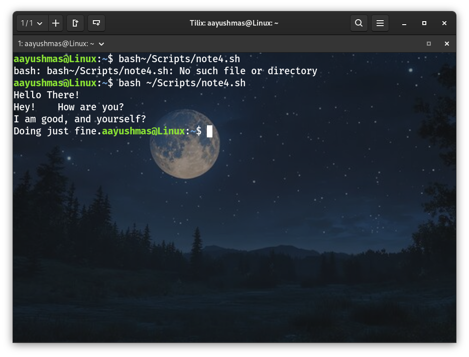

# Notes 4

## How to install and remove software using the APT command.
**APT(Advanced Package Tool)** is a set of tools used for managing Debian packages such as **installing, updating, and removing the software** through command-line interface.

**Formula: `sudo + apt + install/update/remove + package_name`**

### To Install Software:
1. Before installing any software, **first update** all the packages in the system. Use any of these two commands to update Debian.
    * `sudo apt update; sudo apt upgrade -y`

2. Then **install a package** using the following command to install any package we want.
    * `sudo apt install package_name`
    * **For example:**
    `sudo apt install tilix;`
    `sudo apt install bastet`

### To Remove Software:
1. Use the following command to **remove a package without deleting the configuration files**.
    * `sudo apt remove package_name`
    * **For example:** 
    `sudo apt remove cheat;`
    `sudo apt remove firefox`

2. To **completely remove a package including the configuration files** use the following command.
   * `sudo apt purge package_name`
   * **For example:** 
    `sudo apt purge firefox`

3. After uninstalling software, **remove all unused dependencies** and **clean up** the system.
   * `sudo apt clean; sudo apt autoclean; sudo apt autoremove`

We can also **install or remove** multiple programs **at the same time** by adding the package name with space between two package and using **'+' and '-' sign** at the end of each package.
   * **For example:** 
    `sudo apt install tilix+ bastet+ cheat- firefox-`

## How to create a shell script step by step including screenshots and how to run it.
**Shell script** is a text file containing a series of commands created so that the Linux shell can automate the execution of multiple commands. 

The step by step process is as follows:

### Step 1: Create the file
**Open a text editor** and create a script file. Then, save the file as **file_name.sh**.
**For example:** `note4.sh`

### Step 2: Add shell declaration
The first line in the file must be the **shell interpreter** or **shebang** to tell the system which shell to use. 
For **bash shell** it would be: `#!/bin/bash`

### Step 3: Add your code
Write the commands we want the shell to execute when the file is run. 
The **formula or syntax** to write a command is : 
`echo + option + "string"`

**For example:**
`#!/bin/bash`
`echo "Hello There!"`
`echo -e "Hey!\tHow are you?\nI am good, and yourself?"`
`echo -e -n "Doing just fine."`

Then, save and exit.

### Step 4: Run the script
To run the script **open terminal** and use the following command:
`bash~/path/to/script/script_name.sh`

**For example:** `bash~/Scripts/note4.sh`

Then we can see the output displayed in our terminal.

