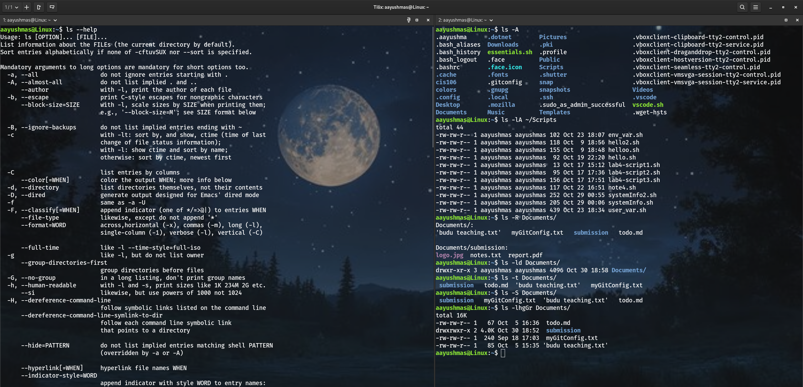
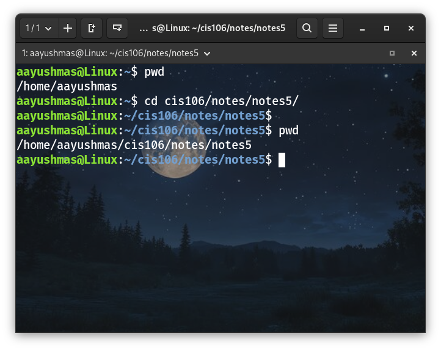
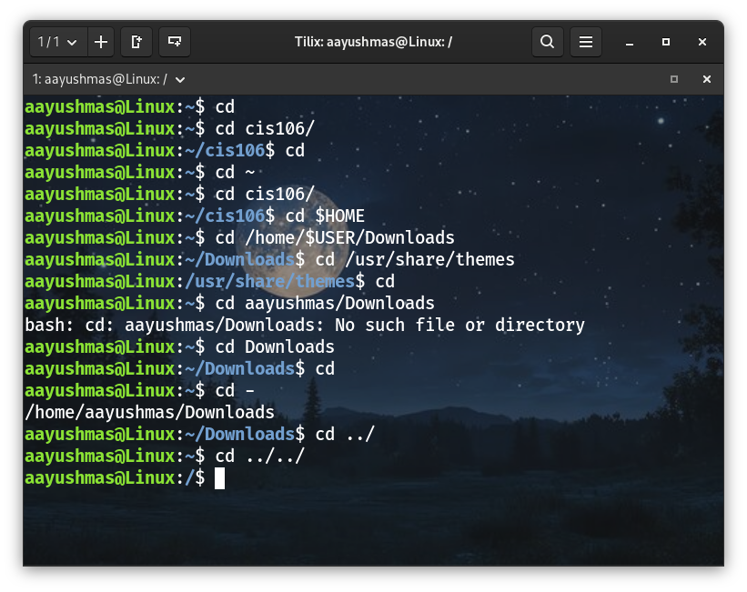

# Note 5

## Commands to navigate the linux file system
## LS
  * **Usage:** 
    * `ls` is used for listing files and directories. 
    * By default it will list the current directory when no directory is specified. 
    * Listing means to see what is inside a directory.
  * **Formula:** 
    * `ls + option + directory(ies) to list`
  * **Examples:**
    * See all the options of the ls command (extracted from the man page):
      * `ls --help`
    * List the current directory:
      * `ls`
    * List all the files including hidden files in current directory:
      * `ls -A`
    * Long list a directory
      * `ls -lA ~/Pictures`
    * List a directory recursively
      * `ls -R Documents/`
    * Long list a directory only
      * `ls -ld Documents/`
    * List a directory sorted by last modified
      * `ls -t Documents/`
    * List a directory sorted by file size
      * `ls -S Documents/`
    * Long list a directory excluding group and owner information, with human readable file size and sorted in reverse order.
      * `ls -lhgGr Documents/`

  

## PWD
  * **Usage:** 
    * Displays the absolute path of the current working directory.
  * **Formula:** 
    * `pwd`
  * **Examples:** 
    * Print the absolute path of current working directory
      * `pwd`

  

## CD
  * **Usage:** 
    * Changes the current working directory. In other words, it moves us from one directory to another. 
    * By default, it will always send us to our home directory.
  * **Formula:**
    * `cd + destination absolute path or relative path`
  * **Examples:**
    * Go (change our current directory) to our home directory:
      * `cd` (without any arguments, cd will take us home)
      * `cd ~` (using the ~ special character. as ~ will expand to the absolute path of the user’s home directory)
      * `cd $HOME` (using the $HOME environment variable)
      * `cd /home/$USER/Downloads` (using $USER environment variable in the path)
    * Go to a specified directory with absolute path:
      * `cd /usr/share/themes`
    * Go to a specified directory with relative path assuming your current working directory is /home
      * `cd aayushmas/Downloads/`
    * Go to the previous working directory. This is useful when you are working with 2 directories located far in the directory tree
      * `cd -`
    * Go to the previous directory in the directory tree. One directory above.
      * `cd ../`
    * Go to 2 directories above the directory tree
      * `cd ../../`

  

## What is a variable?
  In programming, a **variable** is a container or placeholder to store data. A variable is like a box with a label which can be used to store temporary or permanent information that we will continuously reuse in our program. 
  **For example**, `username='aayushmas'` the variable name now stores the value `aayushmas`. Whenever the programs need to access the aayushmas's username, it can do it by referencing the variable `username`.

## How do I use a variable?
* **Creating a variable:**
  * We can create or assign a variable using '**=**' sign.
  * **For example:** `name='aayushma'` (Here, the variable 'name' stores the value 'aayushma')

* **Using a variable:**
  * To use or show the value stored in a variable, add a '**$**' sign before the variable name.
  * **For example:** `echo $name`  which outputs `aayushma` the value that was stored in variable 'name'.

## What is an environment variable?
  **Environment variables** store values of a user’s environment and can be used in commands in the shell. These values can be unique to the user’s environment which makes them ideal when writing commands that we want to use regardless of which user is using the computer. 
  * To see a list of our environment variables type `env`. 
  * To use the value stored in an environment variable we must prepend the    variable name with a `$`.
  * Environment variables are typed in **capital letters** to differentiate from user defined variables.
  * **For example:**
    * **$USER** = stores the current’s user username
    * **$HOME** = stores the absolute path of current’s user home directory
    * **$PWD** = stores the absolute path of the present working directory.
    * **$OLDPWD** = stores the absolute path of the previous current working directory
  
## What is a user defined variable?
  **User defined variables** are created by the user and exist only in the script and subshell that runs the script. It allows us to temporarily store data and use it throughout the script-just like any other programming language.
  * It can be any text string of up to 20 letters, digits, or underscore characters but they **CANNOT start with a number.**
  * User variables are **case sensitive.** (eg: var1 is not Var1)
  * Values are assigned using an **equal sign with no spaces.** (eg: name='Peter')
  * The shell stores all values as text strings; Bash is essentially untyped.
  
## What is the root directory?
  **Root directory** is the first directory in the filesystem that contains the entire filesystem represented by “`/`”.
  
## What does “Parent Directory” mean?
  **Parent directory** is a directory containing one or more directories and files.
  
## What does “Current working directory” mean?
  **Current working directory** is also known as the present working directory. It is the directory where we are currently working in. We are always working from a directory.
  
## What is an absolute path? Include an example.
  An **absolute path** is the location of a file starting at the root of the file system. 
  **For example:**
  `/home/aayushmas/Downloads/list.txt` is the absolute path of the file `list.txt.`
  
## What is a relative path? Include an example.
  A **relative path** the location of a file starting from a child directory of the current working directory or from the current directory itself.
  **An example** of a relative path would be `Downloads/list.txt` assuming that the current working directory is `/home/aayushmas`
  
## What is the difference between “Your home directory” and “The home directory”?
  **YOUR HOME DIRECTORY** is our user’s personal directory where all our files are located. Every user has it’s own home directory. We have total ownership of our home directory but outside of the home directory only the root user can make changes. 
  * **For Example:** An absolute path, assuming that user name is aayushmas, would be `/home/aayushmas`

Whereas, **The Home Directory** is the parent directory of all the home directories. This is where all the users’ home directory are. 
  * **For Example:** The absolute path of this directory is `/home`. Noticed that it starts at the root.