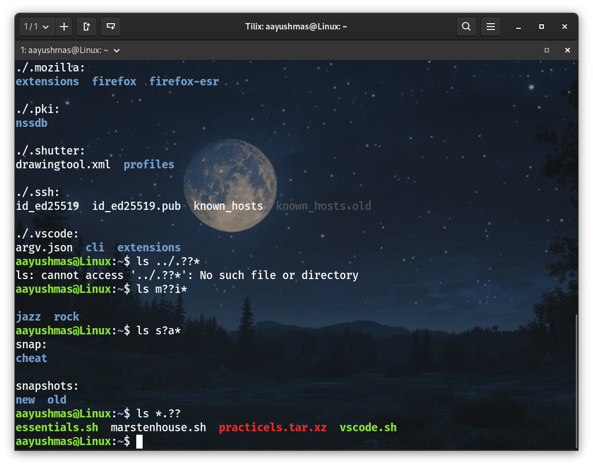

# Notes 7
**Note for professor:** - Due to some unexpected issue with my VirtualBox, there was a delay while submitting this assignment. Please consider it.
## Wildcard
* **A wildcard** is a symbol used to replace or represent one or more characters in a file name.

* **There are 3 wildcards:**
  * `*` : matches zero to any number of characters
  * `?` : matches only 1 character
  * `[]` : matches 1 character from as given set

### The asterisk (*) Wildcard
* The asterisk (*) matches **zero or more characters** in a filename.
* **Examples:**
  * List all the files in a given directory
    * `ls Downloads/*`
  * List all the text files in a given directory
    * `ls Downloads/*.jpg`
  * List all the text files in a given directory that start with letter f
    * `ls Downloads/w*.jpg`
  * List all the files that contain the word file in the name
    * `ls *file*`
  * Move all the files one directory to another
    * `mv ~/Downloads/Nature/* ~/Pictures/wallpapers/`
  * Copy specific files based solely on their file extension
    * `cp ~/Downloads/home/*.pdf ~/Documents/*.txt ~/Projects/school/`
  * Remove specific files
    * `rm ~/Downloads,demo*.exe ~/Videos/*music*.avi`
  * Move specific files from one directory to another
    * `mv Downloads/Movies/{*.png,*.gif} Downloads/Movies/MCU`
  

### The ? Wildcard
* The ? wildcard meta-character matches **precisely one character.**
* The ? wildcard proves very useful when working with hidden files(dot files).
* To list all hidden files use: ls.??* which will match all files that start with a. or .. and have any character after it.
* **Examples:**
  * List all the hidden files in the current working directory
    * `ls ./.??*`
  * List all the hidden files in the parent directory
    * `ls ../.??*`
  * List all the files that have 2 characters in the file name between letters m and i
    * `ls m??i*`
  * List all the files that have a single character between letters s and a
    * `ls s?a*`
  * List all the files with a 2 letter file extension
    * `ls *.??`

### The [] Wildcard
* The brackets wildcard matches a **single character in a range.**
* The brackets wildcard use the exclamation mark to reverse the match.
* For example: match everything except vowels[!aeoiu] or any character except numbers[!0-9]
* **Examples:**:
  * To match all files that have a vowel after letter m:
    * `ls m[aeiou]*`
  * To match all files that do not have a vowel after letter m:
    * `ls m[!aeiou]*`
  * To match all files that have a range of letters after l:
    * `ls l[a-z]*`
  * To match all files whose name has at least one number:
    * `ls *[0-9]*`
  * To match all the files whose name does not have a number in their file name:
    * `ls *[!0-9].*`
  * To match all files whose name begins with a letter from a-p or start with letter s or c:
    * `ls [a-psc]*`
  * To match all files whose name begins with any of these two sets of characters: letters from a-f or p-z:
    * `ls [a-fp-z]*`
  * To match all files whose name begins with any 3 combination of numbers and the current user's username:
    * `ls [0-9][0-9][0-9]$USER`

## Brace Expansion
* **Brace expansion** is a feature of the bash shell that generates argument strings.
* Those strings can be used by commands to operate on files.
* They does not make calls to the operating system like wildcards do.
* They simply generate file names based on a given pattern.

## How to use Brace Expansion to create entire directory structures.
* Start with an open brace
* With no spaces, type your string separating entries by command
* Close the brace
* **Examples:**
  * Create 3 different files with the same name but different file extensions
    * `touch file.{md,txt,rtf}`
  * Create 10 files in a range from 0 to 9
    * `touch file{0..9}.txt`
  *  Remove specific files that start with a given keyword  
     * `rm image_*{01..08}*_camera.{png,jpg}`
  * Create an entire directory tree in a single command(1 level deep)
    * `mkdir -pv project_venus/{code,source,dataset}/new`
  * Create an entire directory tree in a single command(2 level deep)
    * `mkdir -pv project_jupiter/site/{old,new}/{code/{scripts,markup},assets/{imgs,mp3,mp4}}`