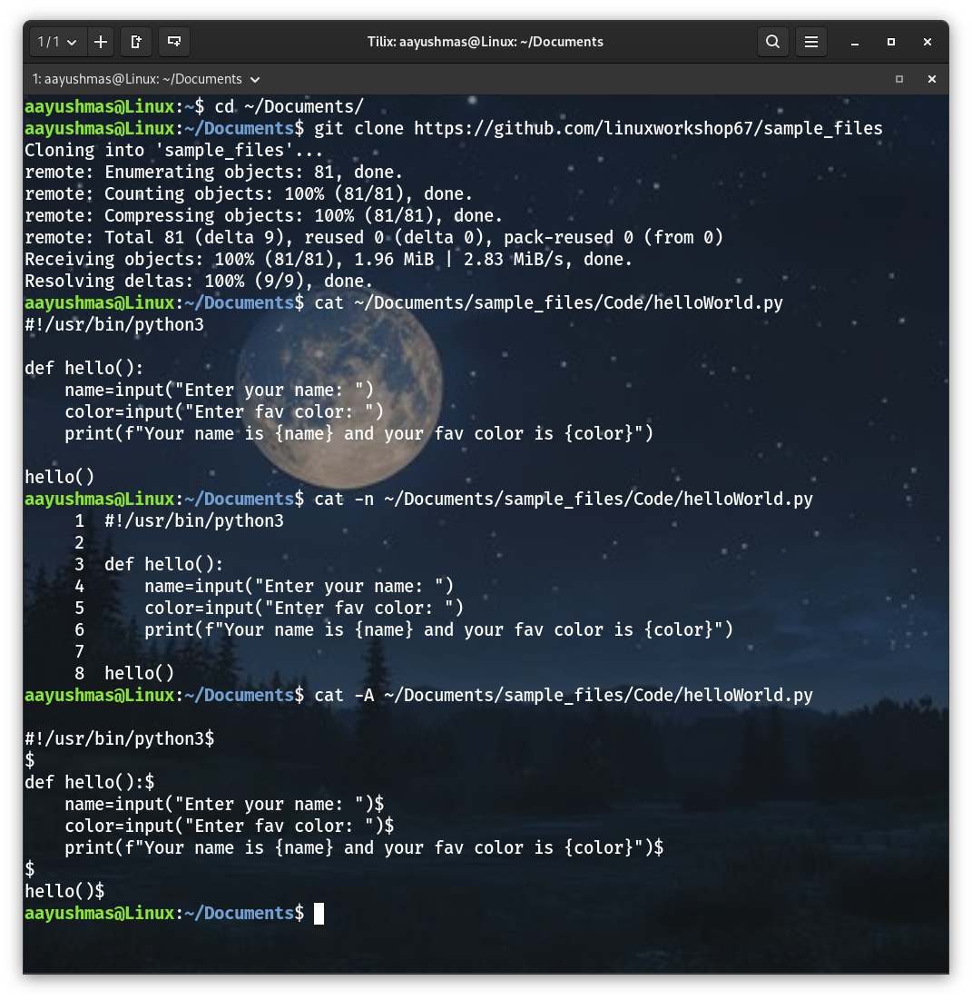
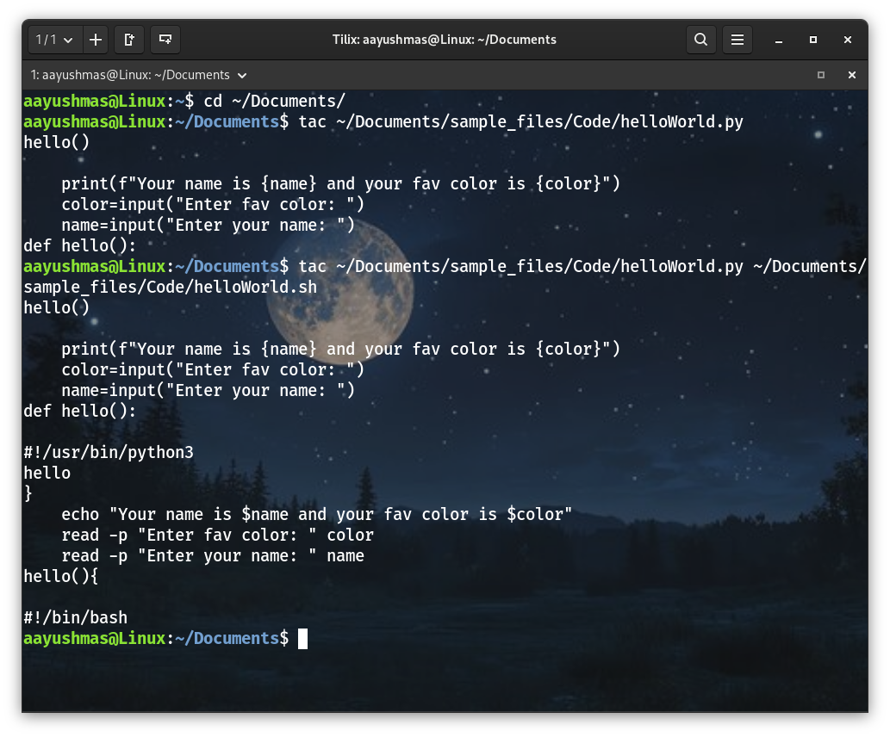
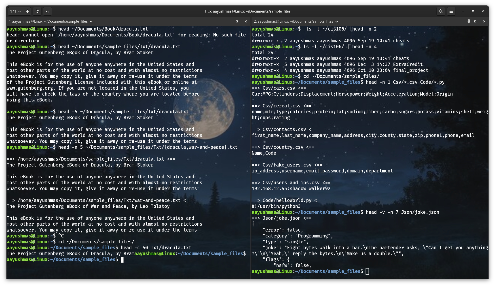
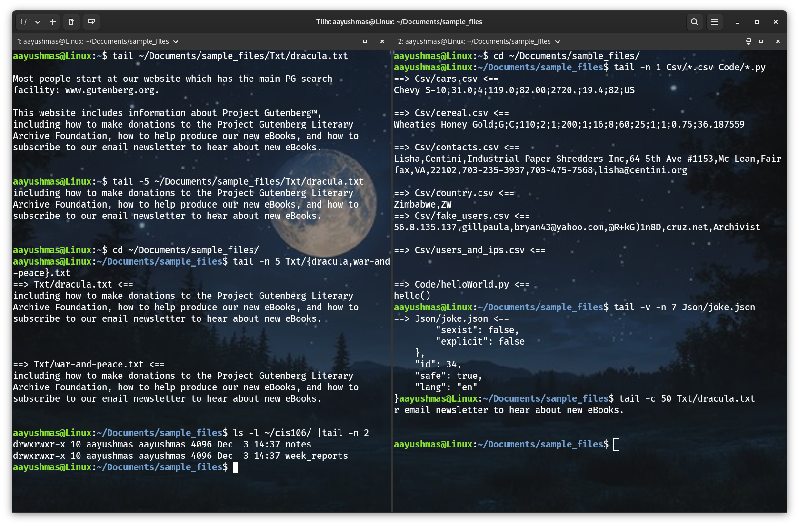
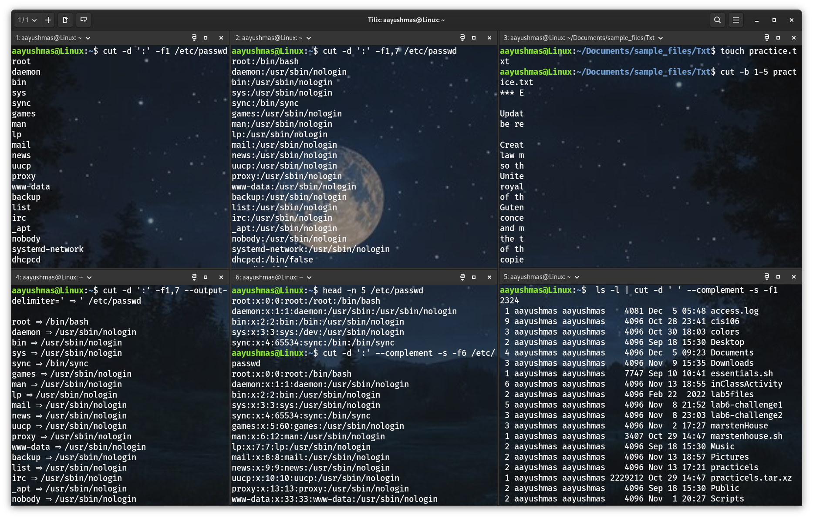
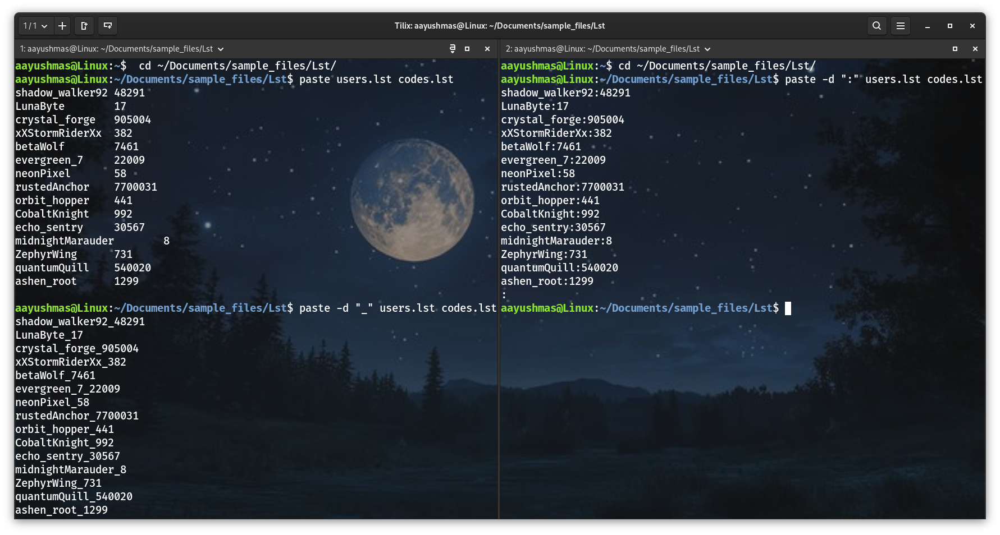
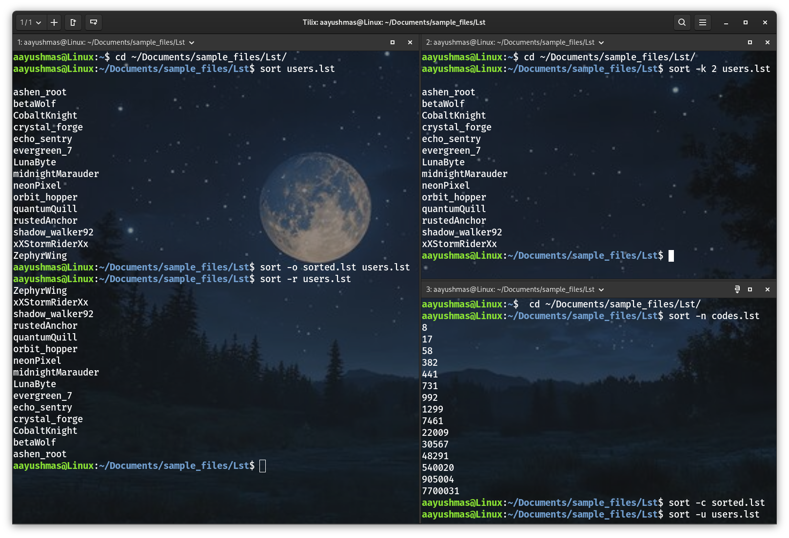
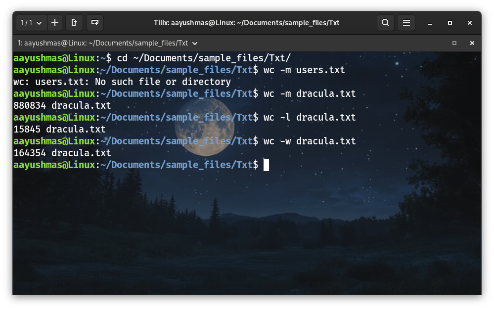

# Notes 8

## CAT
  * **Definition:** 
    * The **cat command** is used for displaying the content of a file.
    * **Cat** is short for **concatenate** which is the command's intended use.
  * **Usage:** 
    * `cat + option + file(s) to display`
  * **Examples:** 
    * Display the content of a file located in ~/Documents/sample_files/
      * `cat ~/Documents/sample_files/Code/helloWorld.py`
    * Display the content of a file **with line numbers**
      * `cat -n ~/Documents/sample_files/Code/helloWorld.py`
    * Display the content of a file including **non printing characters and line endings**
      * `cat -A ~/Documents/sample_files/Code/helloWorld.py`

## TAC
  * **Definition:** 
    * The **tac command** is used for displaying the content of a file in **reverse order**.
    * Just like cat, tac concatenates files and displays the output of the concatenation.
  * **Usage:** 
    * `tac + option + file(s) to display`
  * **Examples:** 
    * Display the content of **a file** located in ~/Documents/sample_files/ in reverse order
      * `tac ~/Documents/sample_files/Code/helloWorld.py`
    * Display the content of **multiple files** in reverse order
      * `tac ~/Documents/sample_files/Code/helloWorld.py ~/Documents/sample_files/Code/helloWorld.sh`

## HEAD
  * **Definition:** 
    * The **head command** displays the top N number of lines of a given file.
    * By default, it prints the **first 10 lines**. If more than one file name is provided then data from each is preceded by its file name.
  * **Usage:** 
    * `head + option + file(s)`
  * **Examples:** 
    * Display the **first 10 lines** of a file
      * `head ~/Documents/sample_files/Txt/dracula.txt`
    * Display the **first 5 lines** of **a file**
      * `head -5 ~/Documents/sample_files/Txt/dracula.txt`
    * Display the **first 5 lines** of **multiple files**
      * `head -n 5 ~/Documents/sample_files/Txt/{dracula,war-and-peace}.txt`
    * Display the **first line of multiple files** using wildcards
      * `head -n 1 Csv/*.csv Code/*.py`
    * Display **a given number of lines** of the output of a given command
      * `ls -l ~/cis106/ |head -n 2`
    * Display the **name of the file** in the output
      * `head -v -n 7 Json/joke.json`
    * Display a **given number of bytes** instead of lines
      * `head -c 50 Txt/dracula.txt`

## TAIL
  * **Definition:** 
    * The **tail command** displays the last N number of lines of a given file.
    * By default, it prints the **last 10 lines**. If more than one file name is provided then data from each fil e is preceded by its file name.
  * **Usage:** 
    * `tail + option + file(s)`
  * **Examples:** 
    * Display the **last 10 lines** of a file
      * `tail ~/Documents/sample_files/Txt/dracula.txt`
    * Display the **last 5 lines** of **a file**
      * `tail -5 ~/Documents/sample_files/Txt/dracula.txt`
    * Display the **last 5 lines** of **multiple files**
      * `tail -n 5 Txt/{dracula,war-and-peace}.txt`
    * Display the **last line of multiple files** using wildcards
      * `tail -n 1 Csv/*.csv Code/*.py`
    * Display a **given number of lines** of the output of a given command
      * `ls -l ~/cis106/ |tail -n 2`
    * Display the **name of the file** in the output
      * `tail -v -n 7 Json/joke.json`
    * Display a **given number of bytes** instead of lines
      * `tail -c 50 Txt/dracula.txt`

## CUT
  * **Definition:** 
    * The **cut command** is used to extract a specific section of each line of a file and display it to the screen.
  * **Usage:** 
    * `cut + option + file(s)`
    
  * **Examples:** 
    * **Display** a list of all the users in your system
      * `cut -d ':' -f1 /etc/passwd`
    * **Display** a list of all the users in your system with their **login shell**
      * `cut -d ':' -f1,7 /etc/passwd`
    * **Cut** a range of **bytes per line**
      * `cut -b 1-5 practice.txt`
    * Cut a file **using a delimiter** but changing the delimiter in the output.
      * `cut -d ':' -f1,7 --output-delimiter=' ⇒ ' /etc/passwd`
    * Cut a file **excluding a given field**
      * `cut -d ':' --complement -s -f6 /etc/passwd`
    * Cut the **permissions from the output** of ls
      * `ls -l | cut -d ' ' --complement -s -f1`

  * **Note:**
    * **-d' '** : Delimiter is the character that separates the field.(here by space)
    * **-d";"** : Separate fields by ;
    * **-f3,4** : Field select the 3rd and 4th fields
    * **--output-delimiter=' ⇒ '** : Replace the default space between the two fields with **⇒**. **(no space after =)**
    * **--complement** : Removes the fields listed and keep the rest
    * **-s** : Suppress lines that don’t contain the delimiter.
    * **ls -l** : Produces long listing output.
    * **|** : Pipe sends the output of the command on the left into the command on the right.(here output from ls is send to cut)

## PASTE
  * **Definition:** 
    * The **paste command** is used for joining files horizontally in columns
  * **Usage:** 
    * `paste + option + files`
  * **Examples:** 
    * **Merge** two files
      * `paste users.lst codes.lst`
    * **Merge** two files **using** a different **delimiter**
      * `paste -d ":" users.lst codes.lst`

## SORT
  * **Definition:** 
    * The **sort command** is used for sorting files. It supports sorting: alphabetically, in reverse order, by number, and by month.
    * The **sort command** follows this order unless specified otherwise:
      * Lines starting with a **number will appear before** lines starting with **letter**.
      * Lines starting with a **letter that appears earlier in the alphabet will appear before** lines starting with a **letter that appears later in the alphabet**.
      * Lines starting with a **lowercase letter will appear before** lines starting with the **same letter in uppercase**.
  * **Usage:** 
    * `sort + option + file`
  * **Examples:** 
    * Sort a file
      * `sort users.lst`
    * Sort a file and **save the output** to a new file
      * `sort -o sorted.lst users.lst`
      * sort -o **output_file input_file**
    * Sort a file in **reverse order**
      * `sort -r users.lst`
    * Sort by **column number**
      * `sort -k 2 users.lst`
    * Sort a file with **numeric data**
      * `sort -n codes.lst`
    * **Check** if a file is sorted
      * `sort -c sorted.lst`
    * **Sort** and **remove** duplicate entries
      * `sort -u users.lst`

## WC
  * **Definition:** 
    * The **wc command** is used for printing the number of lines, characters and bytes in a file
  * **Usage:** 
    * `wc + option + file(s)`
  * **Examples:** 
    * Display the **number of characters** in a file
      * `wc -m dracula.txt`
    * Display the **number of lines** in a file
      * `wc -l dracula.txt`
    * Display the **number of words** in a file
      * `wc -w dracula.txt`

