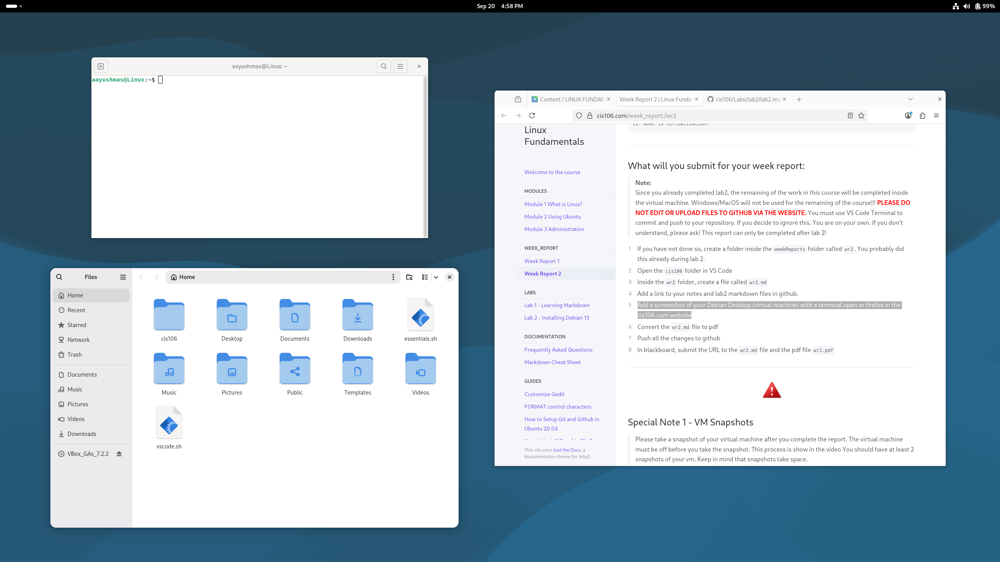

# Week Report 2

## Alternative 1 using the local file path
* [Note 2](../../Notes/notes2/notes2.md)
* [lab2](../../Labs/lab2/lab2.md)

## Alternative 2 using the github url
* [Note 2](https://github.com/aayushma-stha/cis106/blob/main/Notes/notes2/notes2.md)
* [lab2](https://github.com/aayushma-stha/cis106/blob/main/Labs/lab2/lab2.md)

## Debian Desktop
